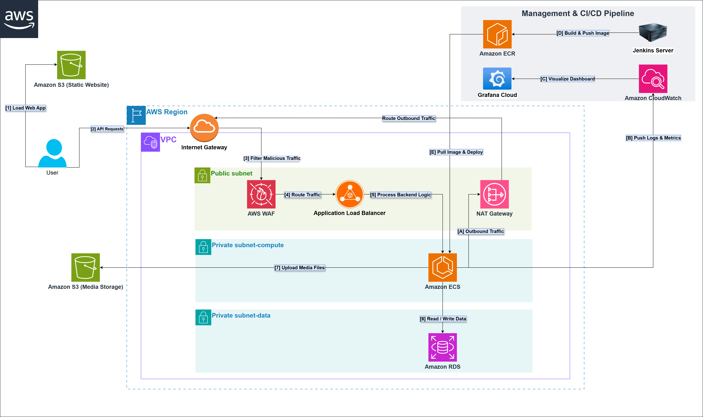

 # Thảo luận Kiến trúc Đồ án Mạng xã hội nội bộ 'Mini Social Network' – Ứng dụng mô hình 3-Tier Architecture trên nền tảng AWS

---

Chào các anh chị và các bạn trong cộng đồng AWS Study Group VN.

Nhóm mình hiện đang trong giai đoạn hoàn thiện đồ án xây dựng hệ thống Mạng xã hội nội bộ mang tên "Mini Social Network". Vận dụng những kiến thức thực hành và tư duy thiết kế từ chương trình AWS FCAJ, nhóm đã quyết định quy hoạch, triển khai toàn bộ hạ tầng dự án lên môi trường AWS Cloud theo chuẩn mô hình 3-Tier Architecture (Kiến trúc 3 lớp) nhằm đảm bảo tính cô lập và bảo mật tối đa cho dữ liệu.

Để chuẩn hóa tài liệu theo phong cách AWS Whitepaper, nhóm đã xây dựng sơ đồ kiến trúc logic bao bọc trong ranh giới AWS Region nhằm thể hiện cấu trúc mạng một cách chặt chẽ nhất. Để mọi người dễ dàng theo dõi dòng chảy của hệ thống, nhóm phân tách rạch ròi thành hai thành phần:

*   **Data Plane (Luồng truy cập & Dữ liệu khách hàng):** Được định tuyến tuần tự bằng số thứ tự [1] đến [7].
*   **Control Plane (Luồng Vận hành & Giám sát hệ thống):** Được đánh dấu bằng chữ cái [A] đến [E].

Dưới đây là diễn giải chi tiết về cơ chế vận hành của hệ thống, nhóm rất mong nhận được những ý kiến phản biện và đóng góp từ cộng đồng:

---

## I. DATA PLANE: PHÂN HỆ TRUY CẬP NGƯỜI DÙNG & XỬ LÝ DỮ LIỆU

### 1. Lớp Biên & Tiếp nhận Yêu cầu (Edge & User Access)
*   **[1] Load Web App:** Giao diện Frontend (được phát triển bằng React + Vite) được đóng gói và lưu trữ tĩnh hoàn toàn trên Amazon S3 (Static Website). Trình duyệt của người dùng sẽ tải trực tiếp tài nguyên giao diện từ đây, giúp tối ưu hóa chi phí và giảm tải tuyệt đối cho hạ tầng xử lý phía sau.
*   **[2] API Requests:** Khi người dùng tương tác (đăng bài, bình luận, thả tim), các API request từ client sẽ được gửi qua Internet Gateway (IGW) để tiến vào môi trường mạng ảo riêng biệt (VPC).

### 2. Lớp Mạng Công cộng & Kiểm soát An ninh (Public Subnet)
*   **[3] Filter Malicious Traffic:** Lưu lượng từ Internet Gateway bắt buộc phải đi qua AWS WAF (Web Application Firewall) để sàng lọc. Tại đây, nhóm cấu hình các bộ quy tắc (Ruleset) nhằm chặn đứng các hình thức tấn công phổ biến như SQL Injection, Cross-Site Scripting (XSS) hoặc spam request.
*   **[4] Route Traffic:** Các traffic sạch và hợp lệ sau đó sẽ được chuyển tiếp đến Application Load Balancer (ALB) để làm nhiệm vụ điều phối tải.

### 3. Lớp Mạng Cách ly & Xử lý Lõi (Private Subnet)
*   **[5] Process Backend Logic:** ALB sẽ phân phối các request một cách cân bằng xuống cụm Amazon ECS Cluster. Đây là nơi chạy các Docker container chứa toàn bộ logic xử lý ứng dụng của mạng xã hội, được nhóm đặt cách ly hoàn toàn trong lớp mạng Private Subnet - Compute để ngăn chặn mọi nguy cơ tiếp cận trái phép trực tiếp từ Internet.
*   **[6] Read / Write Data:** Khi cần truy vấn hoặc ghi nhận thông tin người dùng, cụm ECS sẽ giao tiếp với cơ sở dữ liệu Amazon RDS. Lớp DB này được giấu ở tầng bảo mật sâu nhất là Private Subnet - Data.
*   **[7] Upload Media Files:** Đối với các tài nguyên nặng như hình ảnh, video do người dùng tải lên, cụm ECS sẽ định tuyến và đẩy thẳng ra một bucket Amazon S3 (Media Storage) độc lập để lưu trữ, tránh gây gánh nặng dung lượng và băng thông cho cơ sở dữ liệu chính.

---

## II. CONTROL PLANE: PHÂN HỆ VẬN HÀNH, CI/CD & GIÁM SÁT NGẦM

Đây là xương sống hạ tầng phục vụ cho công tác quản trị và tự động hóa, chạy hoàn toàn độc lập với trải nghiệm của người dùng cuối:

*   **[A] Outbound Traffic:** Để các máy chủ container trong Private Subnet (vốn không có IP công cộng) có thể an toàn đi ra Internet thực hiện tác vụ, nhóm triển khai NAT Gateway tại Public Subnet. Từ đây, lưu lượng sẽ tiếp tục được định tuyến (Route Outbound Traffic) xuyên qua Internet Gateway (IGW) để tiến ra môi trường mạng công cộng. Đây là luồng giao thông một chiều sống còn giúp hệ thống nội bộ an toàn giao tiếp ra bên ngoài (như kéo bản cập nhật Image từ ECR hay đẩy log lên CloudWatch) mà không bao giờ bị lộ danh tính hay địa chỉ IP thực của máy chủ.
*   **[B] Push Logs & Metrics:** Thông qua NAT Gateway, cụm ECS liên tục thu thập và đẩy các dữ liệu nhật ký hệ thống về Amazon CloudWatch.
*   **[C] Visualize Dashboard:** Nhóm thiết lập Grafana Cloud kết nối trực tiếp vào Amazon CloudWatch làm nguồn dữ liệu (Data Source) để trực quan hóa sức khỏe hạ tầng, tài nguyên CPU/RAM thông qua các biểu đồ giám sát real-time.
*   **[D] Build & Push Image:** Luồng CI/CD bắt đầu từ Jenkins Server (đảm nhiệm vai trò tự động hóa kiểm thử, build mã nguồn backend thành các Docker image mới) và tiến hành push lên kho lưu trữ Amazon ECR.
*   **[E] Pull Image & Deploy:** Cụm ECS sử dụng đường dẫn Outbound để tự động kéo (pull) các bản cập nhật Image mới nhất từ ECR về và thực hiện cơ chế cập nhật liên tục (Rolling Update), đảm bảo hệ thống không bị gián đoạn (Zero-Downtime).

---

## III. ĐỊNH HƯỚNG VÀ CÂU HỎI THẢO LUẬN VỚI CỘNG ĐỒNG

Mặc dù trên sơ đồ, nhóm đã đóng khung ranh giới AWS Region rất chuẩn chỉ để quy hoạch toàn cục, nhưng cấu trúc các Subnet bên trong VPC đang được vẽ rút gọn (gộp lại thành một cột) để tối ưu tính trực quan cho người xem.

Thực tế trong file CloudFormation (IaC), nhóm đã triển khai hạ tầng mạnh mẽ hơn hình vẽ rất nhiều. Hệ thống đang chạy trên kiến trúc Đa vùng sẵn sàng (Multi-AZ) – chia đều Public/Private Subnets ra 2 Availability Zones vật lý khác nhau để đảm bảo tính chịu lỗi cao (Reliability). Kết hợp với đó là việc cấu hình chặt chẽ lớp tường lửa Security Groups (Backend ECS chỉ cho phép nhận dữ liệu duy nhất từ ALB thông qua port 8080 chứ không nhận bất cứ luồng nào khác).

Mặc dù hệ thống ở mức PoC (Proof of Concept) đã vận hành trơn tru, nhưng để nâng cấp lên tiêu chuẩn Vận hành thực tế (Production-ready), nhóm đã vạch ra lộ trình tối ưu (Phase 2) và rất mong nhận được những lưu ý "xương máu" từ các anh chị đi trước:

1.  **Nâng cấp hiệu năng Frontend (CloudFront):** Nhận thấy việc người dùng truy cập trực tiếp vào S3 Static Website sẽ tạo điểm nghẽn về tốc độ tải trang toàn cầu và thiếu bảo mật SSL/TLS. Kế hoạch tiếp theo của nhóm là đưa Amazon CloudFront (CDN) ra làm "mặt tiền". Tuy nhiên, khi tích hợp CloudFront + WAF + S3, các anh chị có lưu ý thực tế nào về chi phí ẩn hoặc bài toán cache invalidation (làm mới bộ đệm) khi deploy code Frontend liên tục không?
2.  **Bài toán đánh đổi: NAT Gateway vs VPC Endpoints:** Cụm ECS hiện đang dùng NAT Gateway để ra Internet gọi các dịch vụ AWS (S3, ECR, CloudWatch). Để tối ưu chi phí Data Transfer và tăng tính bảo mật nội bộ, nhóm dự định chuyển đổi sang dùng VPC Endpoints (Gateway/Interface). Với quy mô dự án nhỏ/vừa, việc duy trì phí hàng giờ của Interface Endpoint so với phí Data Transfer của NAT Gateway, điểm hòa vốn (break-even) thực tế thường nằm ở mức lưu lượng nào thưa các anh chị?
3.  **Dịch chuyển luồng CI/CD lên Cloud-Native:** Hiện tại nhóm đang tự host Jenkins Server trên EC2 để phục vụ việc build mã nguồn. Về dài hạn, để cắt giảm hoàn toàn gánh nặng bảo trì máy chủ và tối ưu chi phí (Pay-as-you-go), nhóm dự định migrate toàn bộ pipeline sang GitHub Actions hoặc AWS CodePipeline. Nếu chuyển đổi kiến trúc CI/CD, theo kinh nghiệm thực chiến của mọi người, đâu là giải pháp tối ưu nhất cho hệ thống container hóa trên ECS?

## IV. Sơ đồ kiến trúc về dự án "Mini Social Network"

> Bài viết trên AWS Study Group: Đường link bài Blog https://www.facebook.com/groups/awsstudygroupfcj/permalink/2179386592826301
 
> Nhóm xin chân thành cảm ơn mọi ý kiến phản biện, đóng góp và những "viên gạch quý" giúp nhóm xây dựng hệ thống hoàn thiện hơn từ các anh chị trong cộng đồng!
