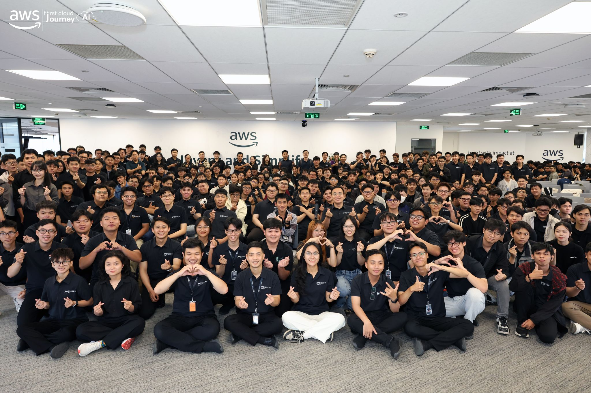

# Post-Event Report "First Cloud AI Journey Community Day - May 2026"

<h4 align="center"><em></em></h4>

### Event Objectives

- Share practical, real-world knowledge and the latest trends in Cloud computing (AWS) and Generative AI (GenAI).
- Update on the IT job market landscape in the AI era and how to equip oneself with an "AI Mindset".
- Provide guidance on best practices when applying LLMs and building Multi-Agent architectures in an Enterprise environment.
- Create a space for networking and exchange among the community of engineers, students, and leading industry experts.

### Speaker List

- **Tinh Truong** - Platform Engineer, GoTymeX
- **Anh Pham** – Cloud Consultant, G-AsiaPacific Vietnam
- **Thinh Nguyen** - DevOps Engineer, FCAJ
- **Thao Nguyen** - GenAI Engineer, VIB
- **Mai Nguyen** - GenAI Engineer, VIB
- **Uyen Le** - GenAI Engineer, VIB
- **Duc Dao** - Solutions Architect, Cloud Kinetics
- **Vy Lam** - Senior Business Systems Analyst, VPBank

### Key Highlights

#### The Importance of Context when Communicating with AI (Presented by: Tinh Truong)

- **Avoid the "Internet Puller" trap:** Do not just blindly "pull" and use any tool or code found on the internet without reviewing whether it fits your project/company's system architecture.
- **Context Optimization:** Avoid rambling across multiple topics in a single thread, which can "dilute" the AI's focus. Clearly provide the specific role, objective, and context for the AI to operate most effectively.
- **AI Mindset:** Encourage a mindset of applying AI practically to solve specific problems rather than aimlessly abusing prompts without direction.

#### Amazon Q Virtual Assistant - Automating Business Intelligence (BI) Analysis (Presented by: Anh Pham)

- **Solving traditional BI challenges:** Simplifies the process of generating reports and analyzing complex business data using AWS's AI virtual assistant.
- **End-to-End Automation:** From a raw Excel data file, users can converse directly to request Amazon Q to analyze and automatically generate intuitive Dashboards in seconds, optimizing the decision-making process without needing a specialized BI team.

#### Cost Optimization & Security with Amazon CloudFront Flat-rate Pricing (Presented by: Thinh Nguyen)

- **Flat-rate pricing mechanism:** Eliminates "Bill Shock" by fixing monthly CDN costs. Enterprises no longer have to worry about incurring tens of thousands of dollars in excess charges when their website faces DDoS attacks or traffic spikes.
- **Deep Infrastructure Security:** Provides advanced security features such as VPC Origin (hiding servers from the public internet, allowing only CloudFront access), mTLS (mutual authentication), and geographic access restrictions (Geo-blocking).

#### The 36-Hour Hackathon Journey: Building the UTM Morpo Tool (Presented by: Uyen, Thao & Mai)

- **UTM Morpo Project:** Applying AI to generate User Interfaces (UI/UX). The standout feature allows developers to interact directly (drag-and-drop, edit components, CSS) right on the AI-generated mockup to save re-rendering time.
- **Practical Lessons:** Faced real-world barriers such as running out of "tokens" mid-process and the AI "over-generation" phenomenon (generating redundant code/overthinking). Through this, the team gained valuable experience in feature pruning and focusing entirely on the core experience when resources are limited.

#### The Probabilistic Nature of LLMs and Parameter Tuning (Presented by: Duc Dao)

- **The qualitative issue of LLMs:** LLMs are inherently probabilistic models. Even with temperature = 0 (Greedy decoding), results can sometimes vary between runs due to GPU floating-point rounding and inference optimization from the API provider.
- **"Hallucination" Control Strategy:** Provided guidance on configuring parameters (Top-p, Temperature, JSON Mode) to integrate LLMs into workflows requiring stability, while emphasizing the critical importance of extensive Testing before deploying the model to a Production environment.

#### Building an Enterprise-grade Multi-Agent System for Startup Credit Scoring (Presented by: Vy Lam)

- **Multi-Agent Architecture:** Instead of "cramming" every task into a single bot, the system is designed to break tasks down into specialized Agents (Financial Analysis, Risk Assessment, Market Research, etc.) operating under the coordination of an Orchestrator. This prevents Context Window overload and improves output accuracy.
- **Security & Compliance:** Introducing AI into enterprises/banks is not just a technical endeavor. The AI system must strictly adhere to Guardrails, prevent attacks via MCP (Model Context Protocol) Attack Vectors, and always maintain an Audit Trail to ensure accountability in all decisions.

### Key Takeaways

#### AI Application Mindset

- **Contextual Communication:** Do not use AI as a quick-fix search engine (Internet Puller). For AI to solve the right problem, developers must establish specific roles, goals, and contexts from the start, avoiding rambling chats that dilute the model's direction.
- **Simplify and Focus on the Core:** From the 36-hour Hackathon lesson, when integrating AI into a product, do not be "greedy" for features or let the AI over-generate code. Know how to "prune" ideas and carefully calculate token limits to ensure a smooth-running system.
- **Using AI to free up manual labor:** Complex data analysis and reporting tasks can be fully automated by virtual assistants (like Amazon Q), enabling non-specialized Business Intelligence (BI) teams to make Data-driven decisions.

#### Technical Architecture

- **Shifting to Multi-Agent:** For large-scale problems, instead of cramming all requirements into a single AI model (which easily overloads the Context Window), breaking the system into specialized agents (Multi-Agent) coordinated by an Orchestrator is the key to increasing accuracy and maintainability.
- **Controlling LLM Randomness:** Understanding the probabilistic nature of LLMs helps in tuning parameters (Temperature, Top-p, JSON mode) appropriately for each task. It also highlights the importance of extensive Testing to prevent AI "hallucinations" before Production deployment.
- **Cloud Infrastructure Cost Optimization:** Choosing flexible pricing mechanisms like CloudFront's Flat-rate pricing is not only a Sales team's concern but also an engineer's (DevOps) responsibility, ensuring the system can scale freely without leading the enterprise into a "Bill Shock" disaster.

#### Enterprise Standards

- **Security & Compliance is Priority #1:** Good engineering is not enough to introduce AI into highly regulated sectors like Banking. Strict Guardrails must be established to control input/output data.
- **Accountability (Audit Trail):** Every autonomous decision made by the AI system (such as credit approval or granting permissions) must be clearly logged. Furthermore, vulnerabilities (MCP attack vectors) must be blocked, and internal networks must be secured (VPC Origin, mTLS).

### Application to Work

- **Apply AI Mindset & Context Optimization:** Change how I communicate with AI in current projects by establishing clear contexts, roles, and objectives upfront instead of using generic prompts (avoiding the "Internet Puller" trap).
- **Design Multi-Agent Architectures:** Begin researching and testing the breakdown of complex AI tasks into a Multi-Agent system (with an Orchestrator coordinating specialized Agents) rather than relying on a single LLM.
- **Optimize and Secure Cloud Infrastructure:** Review content delivery configurations, consider switching to Amazon CloudFront's Flat-rate pricing mechanism to fix costs. Start applying Terraform (IaC) for infrastructure management instead of manual operations.
- **LLM Hallucination Testing:** Adjust parameters (Temperature, Top-p, JSON mode) for current AI features and build comprehensive testing scenarios to ensure stability prior to Production release.
- **Try Amazon Q:** Experiment with integrating Amazon Q into internal BI workflows to automate raw file reading and report/dashboard generation.

### Event Experience

Attending the "AWS First Cloud AI Journey Community Day 2026" was an incredibly rewarding experience, providing me with a comprehensive view of how to practically apply Generative AI (GenAI) and Cloud technologies, especially within large-scale enterprise environments. Some standout experiences included:

#### Learning from Highly Specialized Speakers
- Speakers from AWS, VPBank, VIB, and major tech organizations shared **best practices** in designing modern AI systems.
- Through real-world case studies (like the Startup credit scoring problem), I gained a much clearer understanding of how to apply a **Multi-Agent System** architecture and establish enterprise-grade security standards in large projects.

#### Practical Technical Experience
- Participating in deep-dive sessions helped me visualize the **probabilistic** nature of LLMs and the actual root causes of result variance between runs.
- Learned how to identify and prevent AI system security risks, particularly managing vulnerabilities via **MCP attack vectors**.
- Extracted real-world combat lessons from the 36-hour Hackathon project (UTM Morpo) on controlling token limits and the skill of "idea pruning" to prevent AI over-generation.

#### Application of Modern Tools
- Directly explored the Data/BI automation capabilities of **Amazon Q**, turning dry Excel data into intuitive Dashboards in seconds.
- Deepened my understanding of infrastructure tools like **Amazon CloudFront** with its Flat-rate pricing model and robust network protection layers like **VPC Origin** and **mTLS**.

#### Networking and Exchange
- The workshop created opportunities to interact directly with experts and peers in the Cloud and AI industry, helping to expand my network and better define the strict demands of the current job market.
- Through practical examples, I realized the paramount importance of a **Business-first approach** and an **AI Mindset**, always starting from a correct understanding of the business problem rather than aimlessly adopting technology.

#### Lessons Learned
- Implementing a **Multi-Agent** architecture helps mitigate memory limits (Context Window), increasing accuracy and scalability for AI systems.
- Introducing AI into an Enterprise environment strictly requires adherence to **Security & Compliance**; Guardrails and an Audit Trail must always be established to ensure accountability.
- When deploying a product, one should not rush to "cram" features. Focus on the core value, continuously perform Testing, and optimize infrastructure operational costs.

#### Event Photos
<h4 align="center"><em>Group check-in photo at the event</em></h4>

<h4 align="center"><em>Photo of attendees at the event</em></h4>

> Overall, the "AWS First Cloud AI Journey Community Day - May 2026" event painted a complete picture of how to apply Cloud computing (AWS) and Generative AI (GenAI) in an enterprise environment, helping attendees elevate their mindset from mere coders to real-world Problem Solvers.