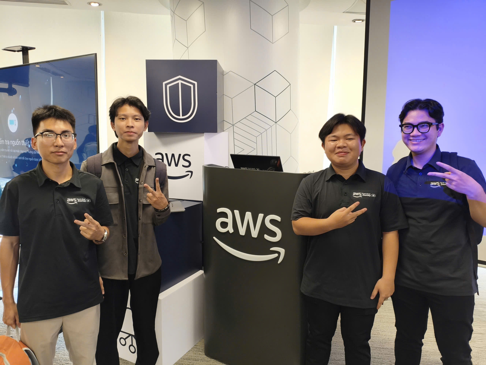

### Mục Đích Của Sự Kiện

- Chia sẻ kiến thức thực chiến và xu hướng mới nhất về Cloud (AWS) và Trí tuệ nhân tạo (GenAI).
- Cập nhật bức tranh thị trường việc làm IT trong kỷ nguyên AI và cách trang bị "AI Mindset".
- Hướng dẫn best practices khi ứng dụng LLM và xây dựng kiến trúc Multi-Agent trong môi trường doanh nghiệp (Enterprise).
- Tạo không gian kết nối, giao lưu giữa cộng đồng kỹ sư, sinh viên và các chuyên gia đầu ngành.

### Danh Sách Diễn Giả

- **Tịnh Trương** - Platform Engineer, GoTymeX
- **Anh Phạm** – Cloud Consultant, G-AsiaPacific Vietnam
- **Thịnh Nguyễn** - Devops Engineer, FCAJ
- **Thảo Nguyễn** - GenAI Engineer, VIB
- **Mai Nguyễn** - GenAI Engineer, VIB
- **Uyển Lê** - GenAI Engineer, VIB
- **Đức Đào** - Solutions Architect, Cloud Kinetics
- **Vy Lâm** - Senior Business Systems Analyst, VPBank

### Nội Dung Nổi Bật

#### Tầm quan trọng của Ngữ cảnh (Context) khi giao tiếp với AI (Trình bày: Tịnh Trương)

- **Tránh bẫy "Internet Puller":** Không nên thấy công cụ (tool) hay code nào trên mạng cũng tự động "kéo" về dùng mà không rà soát lại xem nó có phù hợp với kiến trúc hệ thống của dự án/công ty mình hay không.
- **Tối ưu Context:** Tránh chat lan man nhiều chủ đề trong cùng một luồng khiến AI bị "loãng". Hãy cung cấp rõ vai trò, mục tiêu và ngữ cảnh cụ thể để AI làm việc hiệu quả nhất.
- **AI Mindset:** Khuyến khích tư duy ứng dụng AI vào thực tế để giải quyết các bài toán cụ thể thay vì chỉ lạm dụng prompt một cách không có định hướng.

#### Trợ lý ảo Amazon Q - Giải pháp tự động hóa phân tích dữ liệu kinh doanh (BI) (Trình bày: Anh Phạm)

- **Giải quyết bài toán BI truyền thống:** Đơn giản hóa quá trình lập báo cáo và phân tích dữ liệu kinh doanh phức tạp nhờ trợ lý ảo AI từ AWS.
- **Tự động hóa hoàn toàn:** Từ một file dữ liệu Excel thô, người dùng có thể giao tiếp trực tiếp để yêu cầu Amazon Q phân tích và tự động vẽ ra các Dashboard (bảng điều khiển) trực quan trong vài giây, giúp tối ưu hóa quá trình ra quyết định mà không cần đội ngũ BI chuyên sâu.

#### Tối ưu chi phí & Bảo mật với Flat-rate pricing của Amazon CloudFront (Trình bày: Thịnh Nguyễn)

- **Cơ chế Flat-rate pricing:** Giải quyết nỗi lo "Shock Bill" bằng cách cố định hóa chi phí CDN hàng tháng. Doanh nghiệp không còn lo phát sinh chi phí hàng chục ngàn đô la khi website bị tấn công DDoS hay lượt truy cập tăng vọt.
- **Bảo mật hạ tầng chuyên sâu:** Cung cấp các tính năng bảo mật nâng cao như VPC Origin (ẩn máy chủ khỏi public internet, chỉ cho phép CloudFront truy cập), mTLS (xác thực hai chiều) và giới hạn quyền truy cập theo từng khu vực địa lý.

#### Hành trình 36 giờ Hackathon xây dựng công cụ UTM Morpo (Trình bày: Nhóm Uyển & Thảo & Mai)

- **Dự án UTM Morpo:** Ứng dụng AI để sinh giao diện người dùng (UI/UX). Điểm nổi bật là tính năng cho phép lập trình viên tương tác trực tiếp (kéo thả, chỉnh sửa component, CSS) ngay trên bản vẽ do AI tạo ra để tiết kiệm thời gian tái tạo (re-render). 
- **Bài học thực chiến:** Đối diện với các rào cản thực tế như cạn kiệt "token" giữa chừng và hiện tượng AI "over generation" (sinh code dư thừa/nghĩ quá xa). Qua đó, nhóm rút ra kinh nghiệm quý báu về việc cắt tỉa tính năng và tập trung toàn lực vào trải nghiệm cốt lõi khi nguồn lực có hạn.

#### Bản chất xác suất của LLM và cách tinh chỉnh tham số (Trình bày: Đức Đào)

- **Vấn đề định tính của LLM:** LLM bản chất là các mô hình xác suất (probabilistic). Dù thiết lập temperature = 0 (Greedy decoding), kết quả đôi khi vẫn có sự sai lệch giữa các lần chạy do quá trình làm tròn thập phân của GPU và tối ưu hóa suy luận (inference optimization) từ phía nhà cung cấp API.
- **Chiến lược kiểm soát "Ảo giác":** Hướng dẫn cách cấu hình các thông số (Top-p, Temperature, JSON Mode) để đưa LLM vào các workflow (luồng công việc) đòi hỏi tính ổn định, đồng thời nhấn mạnh tầm quan trọng của việc kiểm thử (Testing) diện rộng trước khi đưa mô hình lên môi trường Production.

#### Xây dựng Enterprise-grade Multi-Agent System để đánh giá tín dụng Startup (Trình bày: Vy Lâm)

- **Kiến trúc Multi-Agent:** Thay vì "nhồi nhét" mọi tác vụ vào một con bot duy nhất, hệ thống được thiết kế chia nhỏ cho nhiều Agent chuyên biệt (Phân tích tài chính, Đánh giá rủi ro, Nghiên cứu thị trường...) hoạt động dưới sự điều phối của một Orchestrator. Điều này giúp tránh quá tải Context Window và nâng cao độ chính xác của output.
- **Bảo mật & Tuân thủ (Security & Compliance):** Đưa AI vào doanh nghiệp/ngân hàng không chỉ là câu chuyện kỹ thuật. Hệ thống AI phải tuân thủ nghiêm ngặt các lớp rào chắn (Guardrails), phòng chống tấn công qua MCP (MCP Attack Vectors) và luôn phải lưu vết (Audit Trail) để đảm bảo trách nhiệm giải trình trong mọi quyết định.

### Những Gì Học Được

#### Tư Duy Ứng Dụng AI

- **Giao tiếp có ngữ cảnh:** Không sử dụng AI như một công cụ tìm kiếm "mì ăn liền" (Internet Puller). Để AI giải quyết đúng bài toán, lập trình viên cần thiết lập vai trò, mục tiêu và ngữ cảnh cụ thể ngay từ đầu, tránh chat lan man làm loãng định hướng của mô hình.
- **Tối giản hóa và tập trung vào cốt lõi:** Từ bài học 36 giờ Hackathon, khi tích hợp AI vào sản phẩm, không nên "tham" tính năng hay để AI tự ý sinh code dư thừa (over generation). Cần biết cách "cắt tỉa" ý tưởng và tính toán cẩn thận giới hạn tài nguyên (token limits) để đảm bảo hệ thống chạy mượt mà.
- **Dùng AI để giải phóng sức lao động:** Các tác vụ phân tích, báo cáo dữ liệu phức tạp hoàn toàn có thể được tự động hóa bằng trợ lý ảo (như Amazon Q), giúp các đội ngũ không chuyên sâu về Business Intelligence (BI) vẫn có thể đưa ra quyết định dựa trên dữ liệu (Data-driven).

#### Kiến Trúc Kỹ Thuật

- **Chuyển dịch sang Multi-Agent:** Đối với các bài toán lớn, thay vì nhồi nhét mọi yêu cầu vào một mô hình AI duy nhất (dễ gây quá tải Context Window), việc chia nhỏ hệ thống thành các tác tử chuyên biệt (Multi-Agent) dưới sự điều phối của một Orchestrator là chìa khóa để tăng độ chính xác và dễ dàng bảo trì.
- **Kiểm soát tính ngẫu nhiên của LLM:** Hiểu được bản chất xác suất của LLM giúp mình biết cách tinh chỉnh các tham số (Temperature, Top-p, JSON mode) phù hợp với từng tác vụ. Đồng thời, nhận ra tầm quan trọng của việc kiểm thử (Testing) diện rộng để tránh tình trạng AI "ảo giác" (hallucination) trước khi đưa lên môi trường Production.
- **Tối ưu chi phí hạ tầng Cloud:** Việc lựa chọn các cơ chế giá linh hoạt như Flat-rate pricing của CloudFront không chỉ là bài toán của đội ngũ Sales mà còn của kỹ sư (DevOps), giúp đảm bảo hệ thống scale thoải mái mà không đẩy doanh nghiệp vào thảm họa "Shock Bill".

#### Tiêu Chuẩn Doanh Nghiệp

- **Bảo mật và Tuân thủ (Security & Compliance) là số 1:** Kỹ thuật tốt là chưa đủ để đưa AI vào các ngành đặc thù như Ngân hàng. Cần phải thiết lập các lớp rào chắn (Guardrails) nghiêm ngặt để kiểm soát dữ liệu đầu vào/đầu ra.
- **Trách nhiệm giải trình (Audit Trail):** Mọi quyết định tự hành của hệ thống AI (như duyệt tín dụng, cấp quyền) đều phải được lưu vết rõ ràng, đồng thời chặn đứng các nguy cơ tấn công qua lỗ hổng (MCP attack vectors) cũng như bảo vệ an toàn cho mạng nội bộ (VPC Origin, mTLS).

### Ứng Dụng Vào Công Việc

- **Áp dụng AI Mindset & Context Optimization:** Thay đổi cách giao tiếp với AI trong dự án hiện tại, thiết lập ngữ cảnh (context), vai trò và mục tiêu rõ ràng ngay từ đầu thay vì chỉ dùng prompt chung chung (tránh bẫy "Internet Puller").
- **Thiết kế kiến trúc Multi-Agent:** Bắt đầu nghiên cứu và thử nghiệm việc chia nhỏ các task AI phức tạp thành hệ thống Multi-Agent (có Orchestrator điều phối các Agent chuyên biệt) thay vì phụ thuộc vào một mô hình LLM duy nhất.
- **Tối ưu và bảo mật hạ tầng Cloud:** Rà soát lại cấu hình phân phối nội dung, cân nhắc chuyển đổi sang cơ chế Flat-rate pricing của Amazon CloudFront để cố định chi phí. Bắt đầu áp dụng Terraform (IaC) để quản lý hạ tầng thay vì thao tác thủ công.
- **Kiểm soát ảo giác LLM (Hallucination Testing):** Điều chỉnh lại các tham số (Temperature, Top-p, JSON mode) cho các tính năng AI hiện tại và xây dựng kịch bản kiểm thử diện rộng để đảm bảo tính ổn định trước khi đưa lên môi trường Production.
- **Try Amazon Q:** Thử nghiệm tích hợp Amazon Q vào quy trình phân tích dữ liệu (BI) nội bộ để tự động hóa việc đọc file thô và xuất báo cáo/dashboard.

### Trải nghiệm trong event

Tham gia sự kiện “AWS First Cloud AI Journey Community Day 2026” là một trải nghiệm rất bổ ích, giúp mình có cái nhìn toàn diện về cách ứng dụng Trí tuệ nhân tạo (GenAI) và Cloud vào thực tế, đặc biệt là trong môi trường doanh nghiệp quy mô lớn. Một số trải nghiệm nổi bật:

#### Học hỏi từ các diễn giả có chuyên môn cao
- Các diễn giả đến từ AWS, VPBank, VIB và các tổ chức công nghệ lớn đã chia sẻ **best practices** trong thiết kế hệ thống AI hiện đại.
- Qua các case study thực tế (như bài toán chấm điểm tín dụng Startup), mình hiểu rõ hơn cách áp dụng kiến trúc **Multi-Agent System** và cách thiết lập các tiêu chuẩn bảo mật (Enterprise Standards) vào các project lớn.

#### Trải nghiệm kỹ thuật thực tế
- Tham gia các phiên trình bày chuyên sâu giúp mình hình dung được bản chất **xác suất (probabilistic)** của LLM và nguyên nhân thực sự gây ra hiện tượng sai lệch kết quả giữa các lần chạy.
- Học cách nhận diện và phòng chống các rủi ro bảo mật hệ thống AI, đặc biệt là quản lý các lỗ hổng qua **MCP attack vectors**.
- Rút ra bài học thực chiến từ dự án Hackathon 36 giờ (UTM Morpo) về cách kiểm soát giới hạn tài nguyên (token limits) và kỹ năng "cắt tỉa" ý tưởng để tránh hiện tượng AI sinh code dư thừa (over generation).

#### Ứng dụng công cụ hiện đại
- Trực tiếp tìm hiểu về khả năng tự động hóa Data/BI của **Amazon Q**, biến dữ liệu Excel khô khan thành Dashboard trực quan trong vài giây.
- Hiểu sâu hơn về các công cụ hạ tầng như **Amazon CloudFront** với mô hình giá Flat-rate và các lớp bảo vệ mạng mạnh mẽ như **VPC Origin** hay **mTLS**.

#### Kết nối và trao đổi
- Workshop tạo cơ hội trao đổi trực tiếp với các chuyên gia, đồng nghiệp trong ngành Cloud và AI, giúp mở rộng networking và định hình rõ hơn yêu cầu khắt khe của thị trường việc làm hiện tại.
- Qua các ví dụ thực tế, mình nhận ra tầm quan trọng của **Business-first approach** và **AI Mindset**, luôn bắt đầu từ việc hiểu đúng bài toán nghiệp vụ thay vì lạm dụng công nghệ một cách vô định.

#### Bài học rút ra
- Việc áp dụng kiến trúc **Multi-Agent** giúp giảm giới hạn bộ nhớ (Context Window), tăng độ chính xác và khả năng scale cho hệ thống AI.
- Đưa AI vào môi trường doanh nghiệp (Enterprise) bắt buộc phải tuân thủ nghiêm ngặt **Security & Compliance**; luôn thiết lập rào chắn (Guardrails) và hệ thống lưu vết (Audit Trail) để đảm -bảo trách nhiệm giải trình.
- Khi triển khai sản phẩm, không nên vội vàng "nhồi nhét" tính năng. Cần tập trung vào giá trị cốt lõi, liên tục kiểm thử (Testing) và tối ưu hóa chi phí vận hành hạ tầng.

#### Một số hình ảnh khi tham gia sự kiện
<h4 align="center"><em>Ảnh check-in nhóm tại sự kiện</em></h4>

<h4 align="center"><em>Ảnh mọi người tham gia sự kiện</em></h4>

> Tổng thể, sự kiện "AWS First Cloud AI Journey Community Day - May 2026" là bức tranh toàn cảnh về cách ứng dụng điện toán đám mây (AWS) và Trí tuệ nhân tạo (GenAI) vào môi trường doanh nghiệp, giúp người tham dự nâng tầm tư duy từ một thợ code đơn thuần thành một chuyên gia giải quyết bài toán thực tế (Problem Solver).
