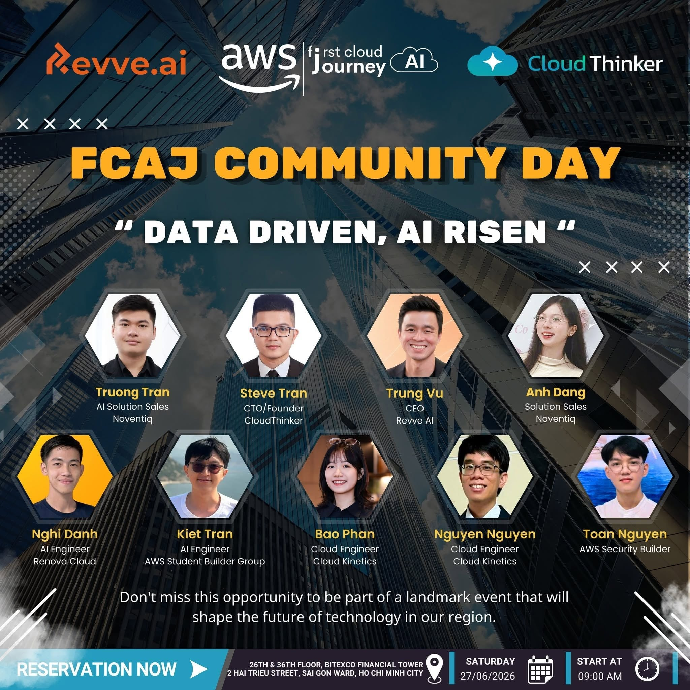

# Post-Event Report "First Cloud AI Journey Community Day - June 2026"

<h4 align="center"><em></em></h4>

### Event Objectives

- Share practical, real-world knowledge and experience regarding Cloud technologies (especially AWS) and Generative AI (GenAI).
- Provide career guidance and insights into the career path of Cloud engineers in the AI era.
- Update on the latest AI solutions, such as Voice AI for Vietnamese, AWS DevOps Agent, and the application of Amazon Q in HR operations and security.
- Create a space for networking and direct Q&A between experts, speakers from tech companies, and the attending community of engineers and students.

### Speaker List

- **Steve Tran** - CTO/Founder, CloudThinker
- **Trung Vu** – CEO, Revve AI
- **Nghi Danh** - AI Engineer, Renova Cloud
- **Kiet Tran** - AI Engineer, AWS Student Builder Group
- **Nguyen Nguyen** - Cloud Engineer, Cloud Kinetics
- **Bao Phan** - Cloud Engineer, Cloud Kinetics
- **Truong Tran** - AI Solution Sales, Noventiq
- **Anh Dang** - Solution Sales, Noventiq
- **Toan Nguyen** - AWS Security Builder

### Key Highlights

#### Career Orientation & Applying Agentic Platforms in Cloud Infrastructure (Presented by: Steve Tran)

- **AI Mindset in Career Path:** The market is shifting from mass hiring to prioritizing Senior engineers capable of applying AI. To avoid being phased out, engineers must gain early exposure to real-world enterprise problems.
- **Solving Technical Debt:** Introduced a specialized Agentic AI platform to support Cloud Infrastructure operations, automating incident response, cost optimization (FinOps), and security testing.
- **Multi-Agent vs. Single-Agent:** Although a Single-Agent can handle most tasks, a Multi-Agent architecture is superior due to its ability to limit the Context Window, save costs, and effectively manage Role-Based Access Control (RBAC) for large-scale systems.

#### Building an Optimized Voice AI Assistant for Vietnamese (Presented by: Trung Vu, Kiet Tran & Nghi Danh)

- **Language Challenge:** Vietnamese is a "low resource" language for large Speech-to-Speech models. The practical solution is a decoupled workflow: Speech-to-Text -> LLM context processing -> Text-to-Speech.
- **Enterprise Customization:** The AI system is fine-tuned for polite interruptions, gender recognition (for appropriate pronouns), and executing automated tasks (Tool Calling). Notably, the system features seamless Human Handoff to a real consultant when it detects customer dissatisfaction.

#### Automating Incident Investigation with AWS DevOps Agent (Presented by: Nguyen Nguyen & Bao Phan)

- **Solving Data Fragmentation:** During an outage, DevOps often spends excessive time searching scattered logs/traces. AWS DevOps Agent automatically aggregates information and builds a system Topology to isolate the incident.
- **Automated 4-Step Process:** Includes Triage -> Root Cause Investigation -> Remediation Proposal -> Architecture Improvement Recommendation.
- **Human-in-the-loop:** AI acts as an investigator and generates remediation scripts, but the approval and Execution rights remain entirely with humans to ensure safety.

#### Applying Amazon Q for HR Digital Transformation (Presented by: Truong Tran & Anh Dang)

- **Solving HR Pain Points:** Manual CV screening methods are time-consuming, prone to emotional bias, and risk exposing internal data if HR uses public AI tools.
- **Amazon Q's Automation Power:** Can be trained (Skills) to automatically match candidate CVs against Job Descriptions, score individual skills in detail, and generate overview reports.
- **Flexible Connectivity:** Easily reads data directly from the enterprise's existing ecosystem, such as Microsoft SharePoint, OneDrive, or Google Workspace, without requiring data migration.

#### Securing the Connection Between Amazon Q and Internal MCP Servers (Presented by: Toan Nguyen & Nghi Danh)

- **Public Endpoint Risks:** Exposing enterprise data from MCP Servers (e.g., JIRA, Internal Databases) to the public internet for AI access is an extremely dangerous security vulnerability.
- **Private Connection Security Solution:** A secure connection architecture utilizing VPC Connections combined with an Application Load Balancer (ALB) and TLS encryption. This solution ensures that communication flows between Amazon Q and internal systems remain completely within the AWS secure environment, strictly adhering to Compliance regulations.

### Key Takeaways

#### Mindset Shift & Career Orientation

- **From "Coder" to "System Orchestrator":** Modern developers shouldn't just compete on coding speed, as AI already does that exceptionally well. Instead, core value lies in business analysis, architectural design, and using AI as a "Copilot" to accelerate Problem Solving.
- **Business-First Approach:** Do not abuse AI merely because it's a trend. Any AI solution introduced to an enterprise (like using Amazon Q for HR or Agentic platforms for DevOps) must resolve real pain points: minimizing manual errors, reducing Mean Time To Recovery (MTTR)/Time-to-Hire, and optimizing costs (FinOps).

#### Lessons on AI Architecture & System Design

- **The Power of Multi-Agent:** For large-scale problems, cramming every "skill" into a single AI model (Single-Agent) easily leads to Context Window overload and access control difficulties. Breaking it down into specialized Agents (Multi-Agent) operating under common orchestration makes the system easier to maintain, optimizes token costs, and tightens Role-Based Access Control (RBAC).
- **Divide and Conquer (Decoupled Workflows):** Lessons from the Voice AI team show that with low-resource languages like Vietnamese, one shouldn't rely on a monolithic Speech-to-Speech model. Decoupling the processing flow into Speech-to-Text -> LLM -> Text-to-Speech increases system flexibility, making it easier to fine-tune context (gender pronouns, interruptions) and execute precise Tool Calling.
- **Observability is a Prerequisite:** AWS DevOps Agent is brilliant, but it becomes "blind" if the infrastructure isn't pre-configured with standard logging flows, metrics, and alarms. AI can only diagnose accurately with transparent input data.

#### Enterprise Operational and Security Standards

- **"Human-in-the-loop" Principle:** Even with powerful automation capabilities, the final decision on critical tasks must always be controlled by humans. For instance, the DevOps Agent only proposes remediation scripts while engineers execute them; Voice AI automatically triggers a Human Handoff when customers show signs of dissatisfaction.
- **AI Connection Security (Private Networking) is Vital:** When deploying AI to read internal company data (Databases, Jira, HR records, etc.), these APIs must absolutely not be exposed to the Public Internet. Utilizing closed internal networks (such as VPC Connections combined with Application Load Balancers) to connect to MCP Servers is a mandatory standard to meet the strictest Compliance requirements.

### Application to Work

- **Update Workflows:** Apply AI to write documentation, summarize incident logs, and conduct basic security testing to save time, allowing focus on complex business logic.
- **Test AI Assistant Integration:** Register for and trial tools like AWS DevOps Agent (currently offering a free tier) or Amazon Q to evaluate their capability to optimize MTTR for the current team.
- **Review AI Connection Security:** If the current project uses OpenAI/Anthropic APIs to read company data, propose re-architecting the data flow (using PrivateLink, VPC) to prevent sensitive information leaks.
- **Promote AI Applications for Non-Tech:** Collaborate with HR or Operations departments to build bots that automate reading internal files/reports, helping them realize the practical value of Cloud and AI.

### Event Experience

The "FCAJ Community Day - June 2026" event was one of the most authentic and valuable experiences regarding bringing AI from "theory" into "real-world combat" within an enterprise environment.

#### Learning from Highly Specialized Speakers
- Speakers from companies like **CloudThinker**, **Revve AI**, **Cloud Kinetics**, and **Noventiq** shared best practices in designing and operating modern AI systems.
- Through practical case studies (like CV scoring for HR or infrastructure incident response), I gained a clearer understanding of why and how to apply a Multi-Agent System architecture instead of a Single-Agent, as well as how to establish secure operational standards **(Enterprise Standards)** in large projects.

#### Practical Technical Experience
- Witnessing deep-dive live demos firsthand helped me clearly visualize how to decouple complex processing flows, such as breaking down the Vietnamese Voice AI model into **Speech-to-Text, LLM, and Text-to-Speech** clusters to optimize latency and accuracy.
- Learned how to identify and prevent security risks when integrating AI with internal data. A standout was the solution utilizing a **VPC Connection** combined with an Application Load Balancer to securely connect with **MCP Servers**, avoiding exposing data to the Public Internet.
- Extracted real-world lessons through a simulated stress-test attack: observed how AI automatically traces logs to find the Root Cause while strictly adhering to the **"Human-in-the-loop"** principle (always requiring a human to approve the remediation script).

#### Application of Modern Tools
- Directly explored the workflow automation capabilities of **Amazon Q**, turning dozens of messy candidate CVs into a visualized scoring and comparison report (HTML Report) in seconds, freeing up manual labor for the HR department.
- Deepened my understanding of infrastructure support tools like **AWS DevOps Agent**, a tool that groups fragmented log/trace data into a clear Topology map, significantly reducing Mean Time To Recovery (MTTR).

#### Networking and Exchange
- The workshop provided opportunities to interact directly with industry experts and peers through highly practical Q&A sessions (such as asking about data transfer costs when using Amazon Q or how to handle regional accents with Voice AI). This helped expand my networking and clearly defined the strict demands of the current job market.
- Through real-world examples, I realized the paramount importance of a **Business-first approach** and an **AI Mindset**: instead of manually coding or aimlessly abusing AI, modern engineers must start by correctly understanding the business problem to become true "Problem Solvers".

#### Lessons Learned
- Applying a **Multi-Agent** architecture and a "divide and conquer" strategy (like decoupling the Voice AI flow into STT -> LLM -> TTS) helps the system overcome memory limits (Context Window), effectively manage permissions, and optimize operational costs.
- Introducing AI into an enterprise environment mandates prioritizing **Security & Compliance**. Data must never be exposed to the Public Internet; instead, private network connections (like **VPC Connections** for MCP Servers) must be used, while always adhering to the **"Human-in-the-loop"** principle (a human must approve the final decision).
- For AI (like AWS DevOps Agent) to be effective, the infrastructure system must ensure data transparency **(Observability)** beforehand. Modern engineers need to equip themselves with an **AI Mindset**, focusing on using AI automation to resolve business "pain points" rather than solely focusing on manual coding.

#### Event Photos
<h4 align="center"><em>Group check-in photo at the event</em></h4>

<h4 align="center"><em>Photo of attendees at the event</em></h4>

> Overall, the "AWS First Cloud AI Journey Community Day - June 2026" event painted a complete picture of a new technological era: AI is no longer limited to simple text-based Q&A but is evolving into specialized Agents (for Infrastructure Operations, Security, HR). To survive and thrive, IT engineers must break away from the rut of being mere "coders" to become creators who master automated workflows.