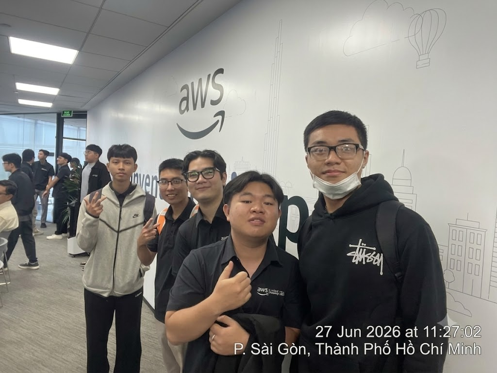
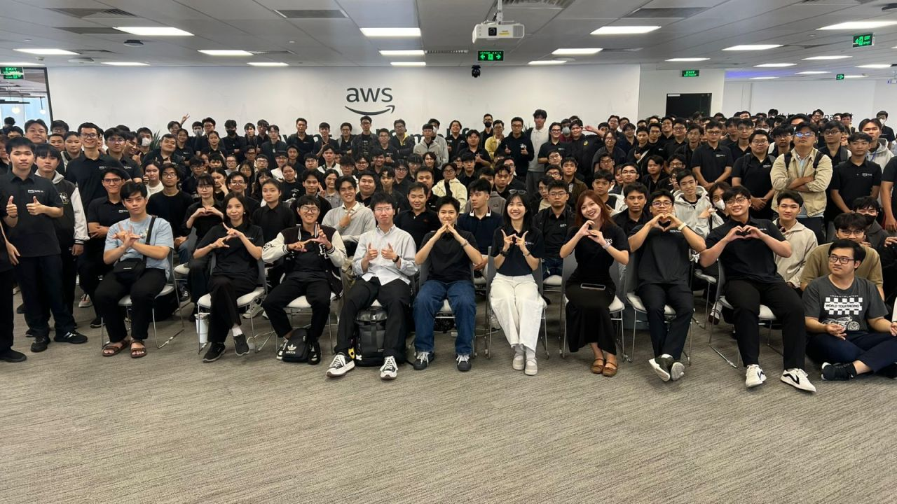

### Event Objectives

- Share practical knowledge and experience regarding Cloud technologies (especially AWS) and Artificial Intelligence (GenAI).
- Provide career guidance and insights into the career path of Cloud engineers in the AI era.
- Update on the latest AI solutions such as Voice AI for Vietnamese, AWS DevOps Agent, and the application of Amazon Q in HR operations and security.
- Create a space for networking and direct Q&A between experts, speakers from tech companies, and the community of attending engineers and students.

### List of Speakers

- **Steve Tran** - CTO/Founder, CloudThinker
- **Trung Vu** – CEO, Revve AI
- **Nghi Danh** - AI Engineer, Renova Cloud
- **Kiet Tran** - AI Engineer, AWS Student Builder Group
- **Nguyen Nguyen** - Cloud Engineer, Cloud Kinetics
- **Bao Phan** - Cloud Engineer, Cloud Kinetics
- **Truong Tran** - AI Solution Sales, Noventiq
- **Anh Dang** - Solution Sales, Noventiq
- **Toan Nguyen** - AWS Security Builder

### Key Highlights

#### Career Orientation & Application of Agentic Platforms in Cloud Infrastructure (Presented by: Steve Tran)

- **AI Mindset in Career Paths:** The market is shifting from mass hiring to prioritizing Senior engineers who know how to apply AI. To avoid being replaced, engineers need to get hands-on experience with real-world business problems early.
- **Solving Technical Debt:** Introduced specialized Agentic AI platforms to support Cloud Infrastructure operations, helping to automate troubleshooting, cost optimization (FinOps), and security testing.
- **Multi-Agent vs. Single-Agent:** While a Single-Agent can perform most tasks, Multi-Agent architecture is superior due to its ability to limit the Context Window, save costs, and is especially effective in functional authorization (RBAC) for large systems.

#### Building Optimized Voice AI Assistants for Vietnamese (Presented by: Trung Vu, Kiet Tran & Nghi Danh)

- **Language Challenges:** Vietnamese is a "low-resource" language for large Speech-to-Speech models. The practical solution is to use the pipeline: Speech-to-Text -> LLM for context processing -> Text-to-Speech.
- **Enterprise Customization:** The AI system is fine-tuned to know how to interrupt politely, recognize gender (to address properly as "Anh/Chị"), and perform automated tasks (Tool Calling). Notably, the system can hand off smoothly to human consultants (Human Handoff) when detecting dissatisfied customers.

#### Automating Incident Investigation with AWS DevOps Agent (Presented by: Nguyen Nguyen & Bao Phan)

- **Solving Data Fragmentation:** When errors occur, DevOps teams often spend a lot of time searching through scattered logs/traces. AWS DevOps Agent helps automatically aggregate information and build system topology to isolate incidents.
- **4-Step Automated Process:** Includes Classification -> Root Cause Investigation -> Suggesting Solutions -> Suggesting Architectural Improvements.
- **Human-in-the-loop:** AI plays the role of investigator and script generator, but the right to approve and execute belongs entirely to humans to ensure safety.

#### Applying Amazon Q for Digital Transformation in HR Processes (Presented by: Truong Tran & Anh Dang)

- **Solving HR Pain Points:** Manual CV screening methods are time-consuming, prone to subjective bias, and carry risks of internal data leaks if HR uses public AI tools.
- **Amazon Q’s Automation Power:** Can be trained (Skills) to automatically cross-reference candidate CVs with Job Descriptions, score each skill in detail, and export summary reports.
- **Flexible Connectivity:** Easily reads data directly from existing enterprise ecosystems like Microsoft SharePoint, OneDrive, or Google Workspace without moving data.

#### Securing Connections between Amazon Q and Internal MCP Servers (Presented by: Toan Nguyen & Nghi Danh)

- **Public Endpoint Risks:** Exposing business data from MCP Servers (like JIRA, Internal Databases) to the public internet for AI access is an extremely dangerous security vulnerability.
- **Private Connection Solution:** Secure connection architecture using VPC Connection combined with Application Load Balancer (ALB) and TLS encryption. This solution ensures the communication flow between Amazon Q and internal systems remains entirely within AWS's secure environment, strictly complying with Compliance regulations.

### Key Takeaways

#### Mindset Shift & Career Orientation

- **From "Coder" to "System Orchestrator":** Modern programmers should not just compete on coding speed, as AI does that too well. Instead, core value lies in the ability to analyze business logic, design architecture, and use AI as a "Copilot" to accelerate Problem Solving.
- **Business-First Approach:** Do not overuse AI just because it's a trend. Every AI solution brought into the enterprise (like using Amazon Q for HR or Agentic for DevOps) must solve real pain points: minimizing manual errors, shortening time (MTTR/Time-to-hire), and optimizing costs (FinOps).

#### Lessons on AI Architecture & System Design

- **Power of Multi-Agent:** For large-scale problems, stuffing every "skill" into a single AI model (Single-Agent) easily leads to Context Window overload and difficult authorization. Breaking it down into specialized Agents (Multi-Agent) operating under common coordination makes the system easier to maintain, optimizes token costs, and manages access rights (RBAC) more tightly.
- **Decoupled Workflows:** Lessons from the Voice AI team show that with low-resource languages like Vietnamese, one should not rely on a monolithic Speech-to-Speech model. Decoupling the processing flow into Speech-to-Text -> LLM -> Text-to-Speech makes the system more flexible, easier to fine-tune context (gendered address, interrupting) and perform Tool Calling more accurately.
- **Observability is a Prerequisite:** AWS DevOps Agent is very intelligent, but it will be "blind" if the infrastructure does not have standard logging, metrics, and alarm flows pre-established. Transparent input data is required for AI to correctly diagnose the "illness."

#### Operational and Security Standards in Enterprises

- **"Human-in-the-loop" Principle:** Even though AI has powerful automation capabilities, the final decision-making power for critical tasks must always be controlled by humans. For example: DevOps Agent only suggests a fix script, the engineer is the one who executes it; or Voice AI automatically performs a Human Handoff to a real employee when customers show signs of dissatisfaction.
- **AI Connection Security (Private Networking) is Vital:** When bringing AI to read internal company data (Database, Jira, HR profiles), never expose these APIs to the Public Internet. Using a closed internal network (like VPC Connection combined with Application Load Balancer) to connect to MCP Servers is a mandatory standard to meet the strictest Compliance requirements.

### Application to Work

- **Update Workflows:** Apply AI to document writing, incident log summarization, and basic security testing to save time, focusing on solving complex business logic.
- **Experiment with AI Assistant Integration:** Register and try tools like AWS DevOps Agent (currently free) or Amazon Q to evaluate the potential for optimizing work processing time (MTTR) for the current team.
- **Review AI Connection Security:** If the current project is using OpenAI/Anthropic APIs to read company data, it is necessary to propose restructuring the data flow (using PrivateLink, VPC) to avoid sensitive information leaks.
- **Spread AI Applications to Non-Tech:** Coordinate with HR or Operations departments to build bots that automate file/internal report reading processes, helping them see the real value of Cloud and AI.

### Event Experience

The "FCAJ Community Day - June 2026" event was one of the most authentic and valuable experiences regarding bringing AI from "theory" into "practice" in an enterprise environment.

#### Learning from High-Caliber Speakers
- Speakers from companies like **Cloud Thinker**, **Revve AI**, **Cloud Kinetics**, and **Noventiq** shared best practices in designing and operating modern AI systems.
- Through practical case studies (such as CV scoring for HR or infrastructure troubleshooting), I better understood the reasoning and methods for applying Multi-Agent System architecture instead of Single-Agent, as well as how to establish **Enterprise Standards** in large projects.

#### Practical Technical Experience
- Witnessing in-depth live-demos helped me clearly visualize how to deconstruct complex processing flows, such as breaking Vietnamese Voice AI models into **Speech-to-Text, LLM, and Text-to-Speech** clusters to optimize latency and accuracy.
- Learned how to identify and prevent security risks when integrating AI with internal data. Highlights include solutions using **VPC Connection** combined with Application Load Balancer for secure connectivity to **MCP Servers**, avoiding data exposure to the Public Internet.
- Learned practical lessons through the stress-test attack simulation: observing how AI automatically traces logs to find the Root Cause while strictly adhering to the **"Human-in-the-loop"** principle (always requiring human approval for fix scripts).

#### Using Modern Tools
- Directly learned about the workflow automation capabilities of **Amazon Q**, turning dozens of messy candidate CVs into an intuitive scoring and comparison report (HTML Report) in just seconds, freeing up labor for the HR department.
- Gained deeper insight into infrastructure support tools like **AWS DevOps Agent**, a tool that groups fragmented log/trace data into a clear Topology map, minimizing MTTR (Mean Time To Recovery).

#### Networking and Exchange
- The workshop created opportunities for direct exchange with experts and colleagues in the industry through very practical Q&A sessions (such as asking about data transfer costs when using Amazon Q or how Voice AI handles local accents). This helped expand networking and clearly define the stringent requirements of the current job market.
- Through practical examples, I realized the importance of a **Business-first approach** and **AI Mindset**: instead of manual coding or aimlessly abusing AI, modern engineers need to start by correctly understanding the business problem to become a true "Problem Solver."

#### Lessons Learned
- Applying **Multi-Agent** architecture and a "divide and conquer" strategy (such as decoupling Voice AI processing into STT -> LLM -> TTS) helps systems overcome memory limits (Context Window), effectively manage permissions, and optimize operating costs.
- Bringing AI into an enterprise environment requires putting **Security & Compliance** first. Absolutely do not expose data to the Public Internet; instead, use private network connections (like **VPC Connection** for MCP Servers), while always adhering to the **"Human-in-the-loop"** principle (humans must be the final decision approvers).
- For AI (like AWS DevOps Agent) to be effective, the infrastructure must ensure **Observability** from the start. Modern engineers need to equip themselves with an **AI Mindset**, focusing on using AI automation to solve business "pain points" rather than just focusing on manual coding.

#### Photos from the event
<h4 align="center"><em>Check-in photo at the event</em></h4>

<h4 align="center"><em>Event group photo</em></h4>

> Overall, the "AWS First Cloud AI Journey Community Day - June 2026" event has opened up a complete picture of a new technological era: AI no longer stops at simple text Q&A but is transforming into specialized Agents (for infrastructure operations, security, HR). To survive and develop, IT engineers need to escape the rut of "coders" to become creators, mastering automation processes.